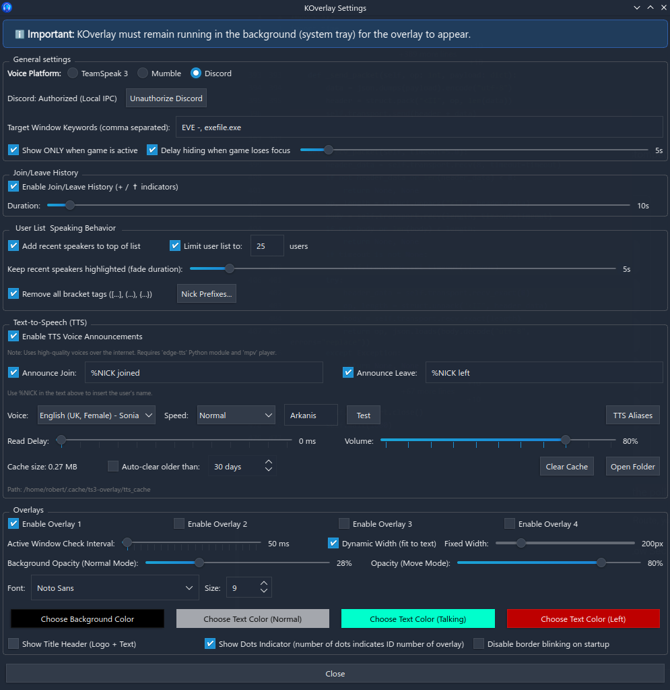
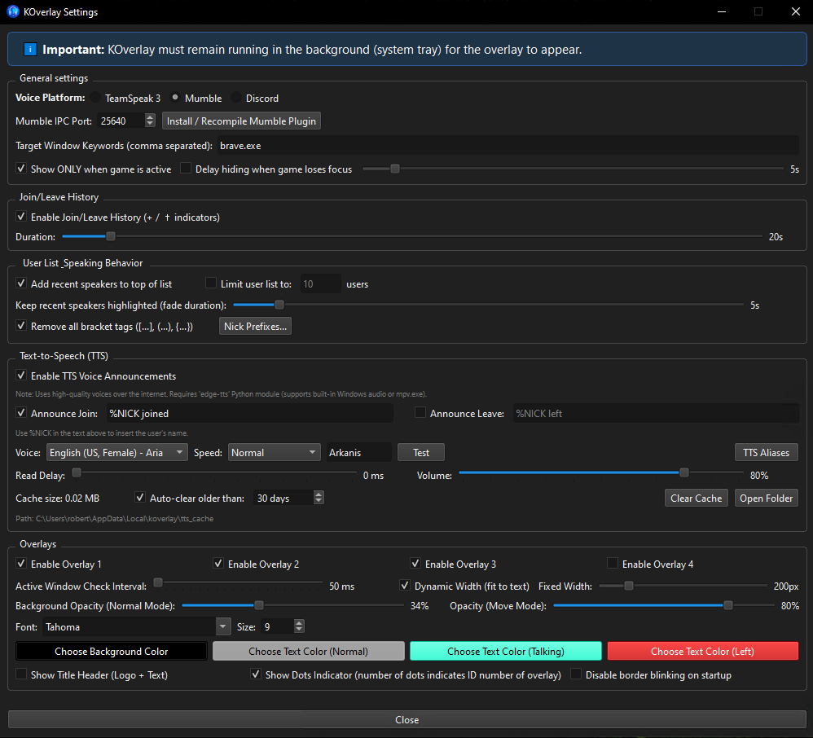
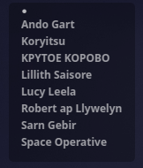
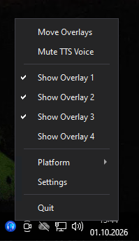

#  KOverlay User Manual
> ✨ *Entirely vibecoded by Gemini* ✨

<p align="center">
  <a href="https://buymeacoffee.com/arkanis" target="_blank">
    
  </a>
</p>

<p align="center">
  <a href="LICENSE"></a>
  &nbsp;
  <a href="https://buymeacoffee.com/arkanis" target="_blank"></a>
</p>

> [!NOTE]
> ☕ **Podoba Ci się KOverlay? / Enjoying KOverlay?**  
> Jeśli ten program jest dla Ciebie przydatny i chcesz wesprzeć moją pracę, możesz postawić mi kawę:  
> 👉 **[Kup kawę na buymeacoffee.com/arkanis](https://buymeacoffee.com/arkanis)** — dziękuję za każde wsparcie! ❤️


> [!TIP]
> **What's New in v1.1.0 (Discord Voice Integration & Tray Platform Switcher):**
> - 🎮 **Discord Voice Platform Integration**: Direct integration with Discord desktop client via local IPC / StreamKit protocol. Displays active voice channels, live speaking indicators, and join/leave events with zero bot setup or server permissions required.
> - 🔄 **Dynamic System Tray Platform Switcher**: Switch effortlessly between TeamSpeak 3, Mumble, and Discord right from the system tray menu (`Platform` submenu located right above Settings) with live checkmark feedback.
> - 🎨 **Brand New Modern Icon**: Complete visual refresh of the application icon across all platforms, including multi-resolution Windows ICO (16x16 to 256x256) and Linux Hicolor icon sets (16 to 512px).
> - 🌗 **Adaptive Windows Dark & Light Theme**: Native integration with Windows 10 & 11 Personalization settings (dark/light palette, tray context menu styling, and immersive DWM dark titlebars) with zero overhead.
> - 🪟 **Solid Opaque Dialogs**: Completely resolved KDE Plasma and Linux compositor translucency bugs by upgrading settings and subordinate dialogs (Aliases, Prefixes) to top-level window structures.
> - 💬 **Explicit Background Running Notice**: Added prominent notices in the Settings window, tray balloon notifications, and documentation clarifying that KOverlay must remain running in the background (system tray) for the in-game overlay to appear.
> - ⚡ **Mumble Zero-Latency Audio**: Fully decoupled plugin Mumble audio callbacks from IPC socket I/O using a background worker thread (`broadcastWorkerLoop`) and condition variable, ensuring pristine voice transmission with zero jitter.
> - ⏱️ **Automatic Channel History & Status Expiry**: Smart timer-based channel join (`+`) and leave (`✝`) status tracking.
> - 🛡️ **Placeholder Suppression**: Filtered out incomplete or unknown client usernames.
> - 📦 **Universal Windows & Linux Distribution**: Standalone setup wizard (`KOverlay_Setup.exe`), zero-install portable ZIP (`KOverlay_Portable.zip`), and official Arch Linux package (`.pkg.tar.zst`).

> [!IMPORTANT]
> **KOverlay must remain running in the background (in the system tray)** for the overlay to appear over your game. If KOverlay is closed, the voice overlay will not be visible.

Welcome to **KOverlay** – a powerful, modern overlay for Linux (X11 and Wayland) and Windows that integrates directly with **TeamSpeak 3**, **Mumble**, and **Discord**, featuring voice announcements (TTS) of nicknames joining and leaving your channel! This step-by-step guide will explain how to configure the connection and what each option in the program menu does.

---

## Screenshots

<p align="center">
  
  <br>
  <em>Unified Settings on Linux (KDE Wayland / X11) - Discord Voice Platform & Customization</em>
</p>

<p align="center">
  
  <br>
  <em>Unified Settings on Windows 10/11 - Mumble Voice Platform & Customization</em>
</p>

<p align="center">
  
  &nbsp;&nbsp;&nbsp;&nbsp;&nbsp;&nbsp;&nbsp;&nbsp;&nbsp;&nbsp;&nbsp;&nbsp;
  
  <br>
  <em>Left: Live Voice Overlay in action (Active Channel & Speaking Indicators) &nbsp;|&nbsp; Right: System Tray Menu with Platform Switcher on Windows</em>
</p>

---

## Part 1: Installation & Requirements

KOverlay supports major Linux distributions natively and provides automated tools for deployment.

### Step 0: Clone the Repository
Before installing from source or using the installer script, clone the repository and navigate into it:
```bash
git clone https://github.com/Arkanista/KOverlay.git
cd KOverlay
```

Choose the appropriate installation method for your distribution below.

### Arch Linux / CachyOS / Manjaro / Garuda Linux

For Arch-based systems, an official `PKGBUILD` and a pre-compiled package are provided for clean system integration.

#### Method A: Build and Install from Source (Recommended)
Building from source automatically handles dependency resolution, including AUR packages:
1. Open a terminal in the cloned `koverlay` directory.
2. Build and install using the following commands:
   ```bash
   # Install dependencies from official repositories
   sudo pacman -S --needed python python-pyqt6 qt6-svg mpv xdotool
   
   # Install kdotool from the AUR (required for active window tracking on Wayland)
   yay -S kdotool   # or: paru -S kdotool
   
   # Build and install the koverlay package
   makepkg -si
   ```

#### Method B: Install the Pre-compiled Pacman Package
1. Download the pre-compiled package from GitHub releases:
   👉 **[Download KOverlay v1.1.0 (.pkg.tar.zst)](https://github.com/Arkanista/KOverlay/releases/download/v1.1.0/koverlay-1.1.0-1-any.pkg.tar.zst)**
2. **Important Note on Dependencies**: The package depends on `kdotool` (which is in the AUR). Standard `pacman` cannot automatically resolve or download AUR dependencies. You must install `kdotool` first:
   ```bash
   yay -S kdotool   # or: paru -S kdotool
   ```
3. Install the downloaded package:
   ```bash
   sudo pacman -U koverlay-1.1.0-1-any.pkg.tar.zst
   # Alternatively, let your AUR helper resolve dependencies and install the local package:
   yay -U koverlay-1.1.0-1-any.pkg.tar.zst
   ```

### Microsoft Windows (10 / 11)

KOverlay offers two convenient ways to run on Windows: a standalone setup wizard (`KOverlay_Setup.exe`) and a zero-install portable archive (`KOverlay_Portable.zip`). Both include an isolated Python 3.11 embeddable environment, all required libraries (PyQt6, ts3, edge-tts), and high-resolution icons. No prior Python installation or administrator privileges are required.

> [!IMPORTANT]
> **KOverlay must remain running in the background (system tray)** for the overlay to appear over your game. If KOverlay is closed, the voice overlay will not be visible.

#### Option 1: Setup Wizard (Recommended)
1. Download the latest installer:
   👉 **[Download KOverlay_Setup.exe (v1.1.0)](https://github.com/Arkanista/KOverlay/releases/download/v1.1.0/KOverlay_Setup.exe)**
2. Run `KOverlay_Setup.exe`:
   - Administrator rights are **not** required. The program installs directly into your user profile: `%LOCALAPPDATA%\Programs\KOverlay`.
   - **Mumble Check:** If Mumble is running, the installer will inform you and prompt you to close Mumble so it can safely install the Mumble plugin.
3. Check the box if you want a **Desktop shortcut**, then click **Install**.
4. On first launch, KOverlay will automatically open the **Settings** window and dock into your Windows System Tray (next to the clock).

#### Option 2: Portable Archive (.zip)
1. Download the portable package:
   👉 **[Download KOverlay_Portable.zip (v1.1.0)](https://github.com/Arkanista/KOverlay/releases/download/v1.1.0/KOverlay_Portable.zip)**
2. Extract the `.zip` archive to any directory you prefer (e.g. `C:\Games\KOverlay` or your Desktop).
3. **How to Launch KOverlay:**
   - Inside the extracted folder, double-click **`KOverlay.bat`**.
   - KOverlay will start quietly in the background without keeping a console window open (`pythonw.exe`).
   - An icon will appear in your **Windows System Tray** (near the clock). Right-click it to open Settings or adjust your overlays.
   - *Diagnostic mode:* If you ever need to view live console logs for debugging, run `KOverlay_Debug.bat`.
4. **Creating a Desktop Shortcut:**
   - Right-click **`KOverlay.bat`** in the extracted folder &rarr; select **Send to &rarr; Desktop (create shortcut)** (or *Show more options &rarr; Send to...* on Windows 11).
   - *(Optional icon)*: Right-click your new shortcut &rarr; **Properties** &rarr; **Change Icon...** &rarr; Browse and select `icon.ico` from your KOverlay folder.
5. **Adding to Windows Startup (Autostart on Boot):**
   - Press `Win + R` on your keyboard, type **`shell:startup`**, and press **Enter**.
   - Windows will open your Startup folder (`%APPDATA%\Microsoft\Windows\Start Menu\Programs\Startup`).
   - Copy and paste your desktop shortcut into this folder (or right-click drag `KOverlay.bat` into this folder and select **Create shortcuts here**).
   - KOverlay will now start automatically in the system tray every time Windows boots!
6. **If you use Mumble:**
   - Make sure Mumble is closed.
   - Run `INSTALL_MUMBLE_PLUGIN.bat` inside the extracted folder to automatically install `koverlay_mumble.dll` to `%APPDATA%\Mumble\Mumble\Plugins`.
   - Alternatively, you can manually copy `mumble_plugin\koverlay_mumble.dll` into `%APPDATA%\Mumble\Mumble\Plugins\`.
   - Launch Mumble, go to **Settings &rarr; Plugins**, and verify that **KOverlay Mumble Plugin** is enabled.

#### Running and Debugging on Windows
- **Desktop & Start Menu Shortcuts:** Launches KOverlay directly without showing a background terminal window (using `pythonw.exe`).
- **Diagnostic Console Mode:** If you ever need to inspect debug logs in real time, run `KOverlay_Debug.bat`.
- **Crash Reports:** In the rare event of an unhandled exception, KOverlay displays a native Windows error dialog with details and logs the traceback to `%LOCALAPPDATA%\koverlay\crash.log`.

#### Uninstallation on Windows
To remove KOverlay when installed via Setup Wizard, open **Windows Settings &rarr; Apps &rarr; Installed apps**, find **KOverlay**, and click **Uninstall** (or run `unins000.exe` in the application folder). For the portable version, simply delete the extracted folder. User configuration is stored in `%APPDATA%\koverlay`.

### Ubuntu / Debian / Linux Mint / Pop!_OS / Fedora / Nobara / openSUSE
For other distributions, a robust, universal installer script is provided:
1. Open a terminal in the KOverlay directory.
2. Run the installer: `./install.sh`
3. The script will automatically detect your package manager (`apt`, `dnf`, `zypper`), install Python and PIP dependencies into an isolated virtual environment (`venv`), and create a desktop shortcut.

> [!WARNING]
> **Active Window Tracking Limit (Wayland on Ubuntu/Debian):** 
> The feature "Show ONLY when game is active" requires either `xdotool` (for X11 displays) or `kdotool` (specifically for KDE Plasma Wayland). 
> 
> If you are using standard **Ubuntu with GNOME Wayland**, the display server strictly prevents apps from reading the active window. To use tracking on GNOME, you must log out and select **"Ubuntu on Xorg" (X11)**.
> 
> **How to install `kdotool` on Debian/Ubuntu (if using KDE Plasma Wayland):**
> Since Ubuntu/Debian do not have AUR, you can download the pre-compiled binary manually from the author's GitHub:
> ```bash
> wget https://github.com/jinliu/kdotool/releases/latest/download/kdotool-0.2.3-x86_64-unknown-linux-gnu.tar.gz
> tar -xzf kdotool-0.2.3-x86_64-unknown-linux-gnu.tar.gz
> sudo mv kdotool /usr/local/bin/
> sudo chmod +x /usr/local/bin/kdotool
> ```

### Bazzite / SteamOS / ChimeraOS (Immutable Systems)

Since Bazzite, SteamOS, ChimeraOS, and other immutable distributions use a read-only root filesystem, running the installer script `./install.sh` directly on the host will fail because directories like `/usr` are write-protected. The recommended way to run KOverlay on these systems is inside a **Distrobox** container (which is pre-installed on Bazzite and simple to set up on SteamOS/ChimeraOS).

> [!WARNING]
> **AI Generated Notice:** The following Bazzite/SteamOS/ChimeraOS container instructions were generated by an AI assistant and have not been physically tested on live installations. Use with caution.

1. Open your terminal.
2. Enter your default Distrobox container:
   ```bash
   distrobox enter
   ```
3. Navigate to the cloned `koverlay` folder inside the container and run the installation script:
   ```bash
   ./install.sh
   ```
4. Export the application to your Bazzite host menu so you can launch it like any native app:
   ```bash
   distrobox-export --app koverlay
   ```

### Uninstallation
To completely remove the application and its shortcuts from your system, simply run `./uninstall.sh`. To clear user settings, delete the `~/.config/ts3-overlay/` folder.

---

## Part 2: How to Connect (TeamSpeak 3, Mumble & Discord)

KOverlay supports three voice backends: **TeamSpeak 3**, **Mumble**, and **Discord**. You can switch between them anytime directly from the **System Tray Menu** (`Platform` submenu) or in the **Settings** window.

### Option A: Connecting to TeamSpeak 3 (ClientQuery)
KOverlay talks directly to your running TeamSpeak 3 application via the built-in **ClientQuery** plugin:
1. Open **TeamSpeak 3** -> `Tools` -> `Options` -> `Addons`.
2. Locate **ClientQuery** and ensure it is **Enabled**.
3. Open its Settings / API Key and copy your key.
4. In KOverlay Settings, select backend **TeamSpeak 3** and paste your API key into the `TS3 API Key:` field.

> [!NOTE]
> On both Linux and Windows, **TeamSpeak 3** works natively through ClientQuery without requiring any custom third-party plugins.

### Option B: Connecting to Mumble (Native Plugin)
KOverlay connects to Mumble via a high-performance native plugin and a local IPC socket on TCP port `25640`.

#### On Linux:
1. Compile and install the plugin (already included if installed via Pacman, or compile manually using the button in Settings or by running `./mumble_plugin/build_and_install.sh`).
2. Open **Mumble** &rarr; `Configure` &rarr; `Settings` &rarr; `Plugins`.
3. Check and enable **KOverlay Mumble Plugin**.
4. In KOverlay Settings, select backend **Mumble** (IPC port `25640` by default).

#### On Windows:
`koverlay_mumble.dll` is bundled directly with the application in `%LOCALAPPDATA%\Programs\KOverlay\mumble_plugin\koverlay_mumble.dll`.
1. In KOverlay Settings, open the Mumble configuration section and click **Install / Update Plugin**. The application will **automatically copy** `koverlay_mumble.dll` into Mumble's plugin directories:
   - `%APPDATA%\Mumble\Mumble\Plugins\koverlay_mumble.dll` *(primary path for modern Mumble 1.4+ / 1.5+)*
   - `%APPDATA%\Mumble\Plugins\koverlay_mumble.dll` *(legacy path)*
2. Open **Mumble** &rarr; `Configure` &rarr; `Settings` &rarr; `Plugins`.
3. Check and enable **KOverlay Mumble Plugin**, then click **Apply**.
4. In KOverlay Settings, switch the active Voice Platform to **Mumble**.

> [!TIP]
> You can also download the standalone plugin or unified bundle directly from GitHub releases:
> - **[koverlay_mumble.mumble_plugin (Universal Bundle)](https://github.com/Arkanista/KOverlay/releases/download/v1.1.0/koverlay_mumble.mumble_plugin)** (Double-click or import via Mumble's "Install plugin" button)
> - **[koverlay_mumble.dll (Windows x64)](https://github.com/Arkanista/KOverlay/releases/download/v1.1.0/koverlay_mumble.dll)**
> - **[koverlay_mumble.so (Linux x64)](https://github.com/Arkanista/KOverlay/releases/download/v1.1.0/koverlay_mumble.so)**

### Option C: Connecting to Discord (Local IPC / StreamKit)
KOverlay connects directly to your running Discord desktop application using Discord's native local IPC RPC protocol:
1. Ensure the **Discord Desktop App** is running on your machine.
2. In KOverlay (via the system tray `Platform` submenu or in Settings), select **Discord**.
3. In Settings, click **"Authorize Discord"**. Discord will pop up a desktop authorization prompt: *"An application wants to access your Discord account"*.
4. Click **Authorize** in your Discord app.
5. KOverlay will immediately display your currently joined voice channel, active speakers, user list, and join/leave events.
6. The authorization token is safely saved in your local configuration, so you will not need to authorize again! The button dynamically switches to **"Unauthorize Discord"** if you ever wish to disconnect or clear the authorization.

> [!NOTE]
> Discord integration tracks the **voice channel** you are currently connected to. When you switch voice channels, KOverlay automatically updates the overlay to show your current channel members. Zero bot configuration, developer portal setup, or server admin permissions are required!

---

## Part 3: Full Description of Features and Settings

The *Settings* window offers highly advanced overlay customization. All options are saved in real-time and updated immediately on the screen, without the need to click a "Save" button.

### Voice Backend & Connection
*   **Voice Platform (TeamSpeak 3 / Mumble / Discord):** Switch the active voice client on the fly.
*   **TS3 API Key / Mumble Port / Discord Re-authorization:** Authorization and port settings for the respective clients.
*   **Target Window Keywords:** Allows you to define window titles KOverlay looks for to detect when the target game is active (e.g., `EVE - `, `exefile.exe`, `Steam`).
*   **Show ONLY when game is active:** Automatically hides the overlay when you alt-tab out of the game.
*   **Delay hiding when game loses focus:** Configurable grace period (1–60s) before hiding the overlay when switching windows.

### User List & Speaking Behavior
*   **Move recent speakers to top of list:** When enabled, users who talk immediately move to the top of the overlay.
*   **Keep recent speakers highlighted (Fade duration):** Slider from 0 to 60 seconds. Provides a smooth color fade transition back to regular text color after someone stops speaking.
*   **Limit user list:** Option to restrict the list to the top `X` active users.
*   **Remove all bracket tags ([...], (...), {...}):** Strips leading tag brackets from player names (e.g. `[CORP] Player` -> `Player`).
*   **Nick Prefixes...:** Opens a dedicated dialog to configure custom prefix strings to strip (e.g. `[VIP]`, `CLAN |`, etc.) from both overlay labels and TTS announcements.

### Overlays Section
*   **Enable Overlay 1 - 4:** KOverlay's architecture allows you to launch up to **four clones** of the overlay. This feature is dedicated to players operating on multiple monitors simultaneously. By checking the respective boxes, you "wake up" the corresponding display identifiers (IDs). For each awakened "ID", the system independently remembers its screen coordinates, allowing you to precisely assign Overlay 2 to the second monitor and Overlay 3 to the third.

### Features
- Displays the current TeamSpeak 3 channel.
- Shows a list of users who are currently speaking (along with a 10-second history of joins/leaves).
- Configurable opacity and a hotkey (default `Shift+Tab`) to show/hide the window containing the event history, including join and leave notifications.
- Integration with the system TTS engine (Edge TTS) to read out join and leave notifications.
- **TTS Aliases (Substitution List)**: Ability to substitute hard-to-pronounce nicknames or remove clan tags so the TTS engine reads them correctly.
- GUI for settings (sliders for TTS volume, window opacity) - accessible from the tray icon.

### Width Settings Section
*   **Dynamic Width (fit to text):** Automatic corset. The window naturally reacts to what's happening inside it. If you have people with short nicknames on the channel, the window stays extremely narrow. It only expands wider when a person with a long nickname enters.
*   **Fixed Width:** Manual frame. If you uncheck *Dynamic Width*, the *Fixed* slider activates. It allows you to impose an absolute, rock-solid width in pixels on the program (from 50px to 1000px). Regardless of the length of the players' nicknames, the frame will strictly stick to this dimension. This prevents the UI layout from "jumping" around.

### Background & Colors Section
*   **Background Opacity (Normal Mode):** Controls the opacity of the base overlay tiles (the "glass") while playing. Pulling the slider to *0%* removes the virtual window box – leaving only the dry letters of the nicknames floating phenomenally over the game itself.
*   **Background Opacity (Move Mode):** The opacity value imposed exclusively when manual positioning mode is enabled (see tray menu). The optimal approach is to crank this value up while arranging the overlay, to more clearly draw the edges of the window you need to grab with the mouse.
*   **Choose Background Color:** The primary color of the frame/background window. Supports alpha transparency (you can choose the tint of the glass frame).
*   **Choose Text Color (Normal):** Imposes the selected color on the letters identifying the nickname of a player who is currently on the channel with you, but is silent and not transmitting voice.
*   **Choose Text Color (Talking):** Speaker highlight. This defines the intense color that a player's nickname entry will "flash" when they press their push-to-talk button or activate their microphone via voice activation in TS3.
*   **Choose Text Color (Left):** Ghost highlight. Defines the color for users who have recently left the channel but are still displayed on the screen due to the "History Duration" setting.

### Typography Section
*   **Font / Size:** Standard system font picker. Allows you to swap the overlay font and set its absolute size (e.g., 11, 14, or increase to 20 for 4K resolution monitors).

### Visual Options Section
*   **Show Title Header (Logo + Text):** Official overlay header. Adds a distinct visual program logo and a text identifier (e.g., "KOverlay - ID 1") to the frame. Keeps the window looking like a classic software block.
*   **Show Dots Indicator:** Highly compact mode. If you disable the *Title Header*, you can enable the "Dots Indicator". This makes the text header disappear, leaving only tiny, LED-like dots (`•••`) at the very top of the frame. The number of dots displayed corresponds to the identification number of that display clone (1 dot = Overlay ID 1). The footprint is minimized to physical zero, and the dotted line is small enough not to interfere with the game, while serving as the only available drag-handle for the mouse when arranging the element on the screen!
*   **Disable border blinking on startup:** By default, KOverlay "blinks" its outer border in an aggressive red color upon invocation (for a 5-second cycle). This functionality was implemented so that the player, amidst cluttered screens, can instantly visually locate where the hidden transparent window spawned. This option permanently disables the blinking signal – maximizing minimalism.

### Join/Leave History Section
*   **Enable Join/Leave History (+ / ✝ indicators):** When enabled, KOverlay tracks the presence of users. New users joining the channel will be prefixed with a bold `+ ` for a specified duration. Users who leave the channel will stay on the list for the specified duration but will be pushed to the bottom, prefixed with a `✝ ` symbol, and colored gray (or a custom color of your choice). This allows you to know who just entered or left without looking at the TS3 window!
*   **History Duration:** Defines how long (in seconds) the new/left users keep their visual indicators before fading away (left users) or turning into regular users (new users).

### Text-to-Speech (TTS) Section
*   **Enable Text-to-Speech (TTS):** Text-to-Speech integration! When enabled, whenever someone joins or leaves the channel, a natural AI voice from Microsoft Azure will announce their arrival/departure out loud. 
    * *Requires active internet connection for the high-quality voice.*
    * *Requires the `edge-tts` python module and the `mpv` video player to be installed on your Linux system. (These are installed automatically via our universal installers).*
*   **TTS Voice / Language:** Allows you to select the voice persona. Currently supports highly realistic voices: **English Female (Aria)** and **Polish Female (Zofia)**. You can easily test how they sound by clicking the "Test" button!
*   **TTS Speed Control:** Adjust the reading speed from `-50%` to `+100%`. Fast speeds are perfectly supported!
*   **TTS Phrase for Join / Leave:** Allows you to completely customize what the voice says. Use the special variable `%NICK` to place the user's name in the sentence. For example, typing `%NICK arrived on the battlefield` will cause the bot to say exactly that!
*   **Read Delay:** Defines a delay (up to 3 seconds) before the TTS voice speaks, preventing overlaps with standard TS3 joining sounds.
*   **Volume:** Slider to independently control the loudness of the TTS announcements (0% to 100%).
*   **TTS Queueing:** Announcements are safely queued and played seamlessly one after another without overlapping. We use hardware-accelerated silence removal to ensure perfect, gapless playback when multiple people join at once!
*   **TTS Persistent Cache:** KOverlay smartly caches generated speech files locally in a human-readable format to avoid unnecessary network calls. You can view the cache size, open the cache folder, clear it manually, or configure the **Auto-clear** feature to automatically delete audio files older than a specified number of days.

---

## Part 4: System Tray Interface (Move Mode)

**Right-Clicking** the icon in the bottom-right corner of the system tray (next to the system clock) opens the KOverlay menu with two critical operational entries (aside from accessing settings):

1. **Move Overlays (Checkbox):** 
   * Launches "Rearrangement" mode when checked.
   * Normally, the overlay ignores all clicks (the cursor passes through it to the game below) so you don't accidentally click it during gameplay!
   * Activating this option freezes mouse communication with the game beneath the window frame, colors the KOverlay frame into a visible dashed line, and applies the "Move Mode" opacity.
   * In this mode, simply grab any of the enabled windows with the Left Mouse Button and move it freely to any corner of the monitor.
   * **To lock the positions**, simply uncheck `Move Overlays` in the tray menu. The overlays will instantly freeze, hide the auxiliary dashed edges, and resume ignoring mouse strikes, passing control directly back to the game client!
   * > [!NOTE]
   * > **Automatic Move Mode:** Opening the **Settings** window from the tray menu will also automatically force all active overlays into "Move Mode" for as long as the settings window remains open. Closing the settings window will revert the overlays to their previous locked state.

2. **Mute TTS Voice (Checkbox):**
   * A quick toggle switch. Checking this option will instantly mute all voice announcements without changing your master settings. Perfect for temporarily silencing the bot without having to open the full Settings panel!

3. **Platform / Voice Platform (Submenu):**
   * Placed conveniently right above the **Settings** action in the tray menu.
   * Expands into three mutually exclusive choices: **TeamSpeak 3**, **Mumble**, and **Discord**.
   * Displays a checkmark next to the currently active platform.
   * Selecting another platform dynamically reconfigures the voice client on the fly, without needing to open the full Settings window or restart the app!

---

## Support

If you find KOverlay useful and want to support its ongoing development, you can buy me a coffee!

<p align="center">
  <a href="https://buymeacoffee.com/arkanis" target="_blank">
    
  </a>
</p>

---

## License

This project is licensed under the **GNU General Public License v3.0 (GPLv3)**. See the [LICENSE](LICENSE) file for the full text of the license.


